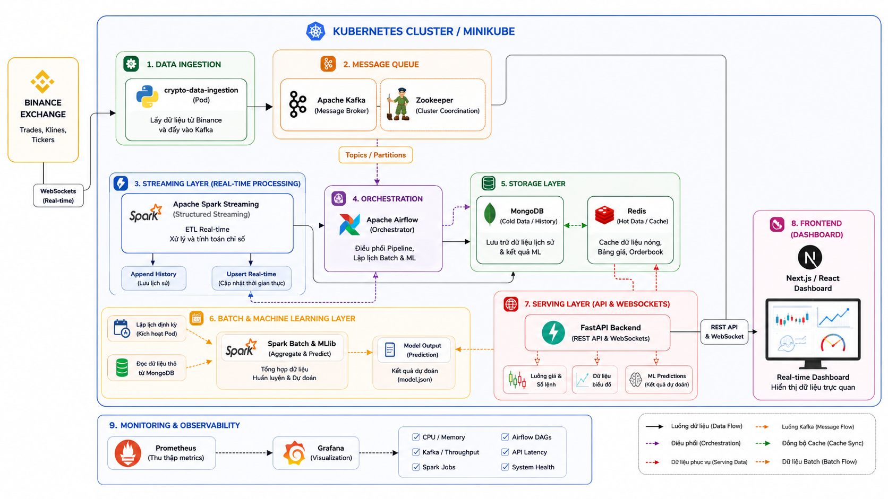
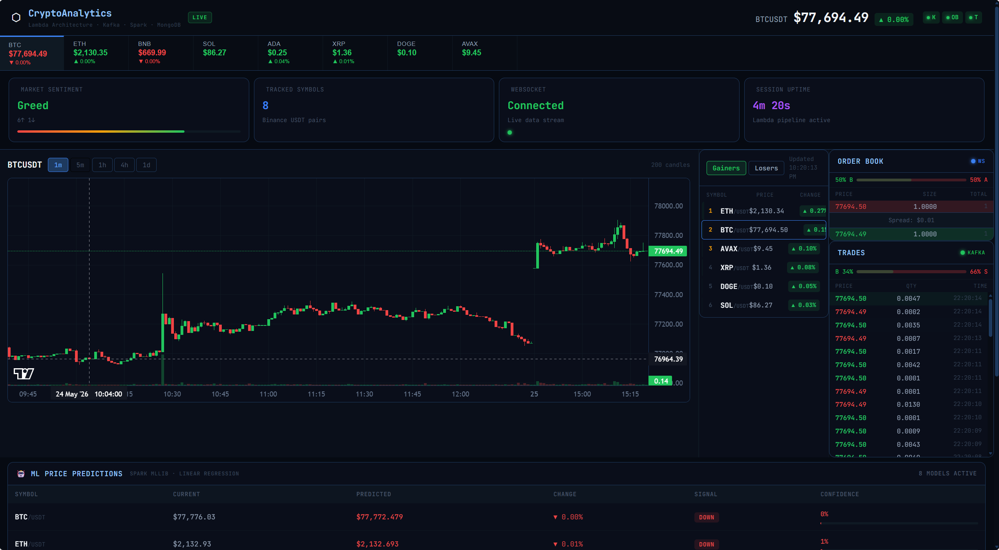
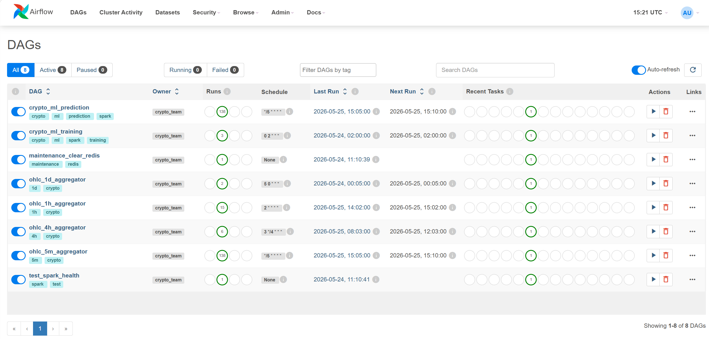

# 🚀 Hệ Thống Phân Tích Dữ Liệu Cryptocurrency Realtime theo Lambda Architecture

<p align="center">
  <b>Nền tảng phân tích dữ liệu cryptocurrency realtime sử dụng Kafka, Spark Streaming, Spark MLlib, Airflow, FastAPI, Next.js và Kubernetes.</b>
</p>

---

# 👨‍💻 Thành viên nhóm

| Họ và tên | MSSV |
|---|---|
| Phạm Vương Minh Quang | 20235205 |
| Trần Quang Huy | 20235112 |
| Đoàn Quốc Việt | 20235244 |
| Nguyễn Tuấn Kiệt | 20225203 |
| Nguyễn Minh Tuấn | 20232356 |

---

# 📖 Giới thiệu

Dự án xây dựng một nền tảng phân tích dữ liệu cryptocurrency realtime theo kiến trúc **Lambda Architecture** nhằm xử lý:

- Streaming dữ liệu realtime
- Batch processing
- Machine Learning prediction
- Dashboard realtime
- Distributed Big Data processing

Hệ thống được triển khai hoàn toàn trên Kubernetes (Minikube) theo mô hình Microservices.

---

# 🎯 Mục tiêu dự án

Hệ thống hỗ trợ:

- Thu thập dữ liệu realtime từ Binance WebSocket
- Streaming analytics realtime bằng Spark Structured Streaming
- Batch aggregation dữ liệu OHLC nhiều khung thời gian
- Huấn luyện mô hình Machine Learning dự đoán giá
- Hiển thị dashboard realtime
- Monitoring toàn bộ pipeline bằng Grafana + Prometheus
- Triển khai phân tán bằng Kubernetes

---

# 🏗️ Kiến trúc hệ thống

## Lambda Architecture

Hệ thống gồm hai lớp xử lý chính:

---

## ⚡ Speed Layer (Realtime Processing)

```text
Binance WebSocket
        ↓
Apache Kafka
        ↓
Spark Structured Streaming
        ↓
Redis + MongoDB
        ↓
FastAPI WebSocket
        ↓
Next.js Dashboard
```

---

## 🧠 Batch Layer (Machine Learning & Aggregation)

```text
MongoDB Historical Data
        ↓
Apache Airflow
        ↓
Spark Batch Jobs
        ↓
OHLC Aggregation
        ↓
Machine Learning Training
        ↓
Prediction Results
```

---

# 🖼️ Workflow hệ thống

<p align="center">
  
</p>

---

# ✨ Chức năng chính

## 📡 Realtime Data Streaming

- Thu thập dữ liệu realtime từ Binance
- Streaming dữ liệu bằng Kafka
- Spark Structured Streaming xử lý realtime
- WebSocket realtime update

---

## 📊 Market Analytics

- Candlestick charts realtime
- Orderbook visualization
- Trades feed realtime
- Top gainers / losers
- Market statistics

---

## 🤖 Machine Learning

- Aggregation dữ liệu OHLC
- Feature engineering
- Price prediction
- Spark MLlib training & inference
- Airflow orchestration

---

## ☸️ Cloud Native Infrastructure

- Kubernetes deployment
- Dockerized microservices
- Persistent Volumes
- ConfigMaps & Secrets
- Scalable distributed architecture

---

## 📈 Monitoring & Observability

- Prometheus metrics
- Grafana dashboards
- Spark monitoring
- Kafka throughput monitoring
- API latency monitoring

---

# 🛠️ Công nghệ sử dụng

| Thành phần | Công nghệ |
|---|---|
| Frontend | Next.js, React, TypeScript |
| Backend | FastAPI, WebSockets |
| Streaming | Apache Kafka |
| Realtime Processing | Spark Structured Streaming |
| Batch Processing | Spark MLlib |
| Workflow Orchestration | Apache Airflow |
| Database | MongoDB |
| Cache | Redis |
| Infrastructure | Kubernetes, Docker |
| Monitoring | Prometheus, Grafana |

---

# 📂 Cấu trúc thư mục

```text
.
├── docker-compose.yml
├── docs
│   └── images
│       ├── airflow.png
│       ├── dashboard.png
│       └── workflow.png
├── get_helm.sh
├── k8s
│   ├── apps
│   │   └── data-ingestion.yaml
│   ├── compute
│   │   ├── spark-jobs
│   │   │   ├── native-streaming.yaml
│   │   │   ├── ohlc-1d-aggregator.yaml
│   │   │   ├── ohlc-1h-aggregator.yaml
│   │   │   ├── ohlc-4h-aggregator.yaml
│   │   │   ├── ohlc-5m-aggregator.yaml
│   │   │   ├── predict-price.yaml
│   │   │   ├── streaming-job.yaml
│   │   │   └── train-price-prediction.yaml
│   │   └── spark-operator-values.yaml
│   ├── config
│   │   ├── configmaps.yaml
│   │   └── secrets.yaml
│   ├── message-queue
│   │   ├── kafka.yaml
│   │   └── zookeeper.yaml
│   ├── namespaces.yaml
│   ├── orchestration
│   │   ├── airflow-init.yaml
│   │   ├── airflow.yaml
│   │   ├── backend.yaml
│   │   ├── frontend.yaml
│   │   └── model-pvc.yaml
│   ├── routing
│   │   └── ingress.yaml
│   └── storage
│       ├── mongodb.yaml
│       ├── postgres.yaml
│       └── redis.yaml
├── monitoring
│   ├── grafana
│   │   ├── dashboards
│   │   │   └── crypto.json
│   │   └── provisioning
│   │       ├── dashboards
│   │       │   └── crypto.yaml
│   │       └── datasources
│   │           └── prometheus.yaml
│   └── prometheus.yml
├── reproduce.md
├── scripts
│   ├── mongo-init.js
│   └── start.sh
└── services
    ├── airflow
    │   ├── Dockerfile
    │   └── dags
    │       ├── __pycache__
    │       │   ├── maintenance_dag.cpython-38.pyc
    │       │   ├── ml_prediction_dag.cpython-38.pyc
    │       │   └── ohlc_spark_aggregator.cpython-38.pyc
    │       ├── maintenance_dag.py
    │       ├── ml_prediction_dag.py
    │       └── ohlc_spark_aggregator.py
    ├── backend
    │   ├── Dockerfile
    │   ├── __init__.py
    │   ├── config.py
    │   ├── kafka_manager.py
    │   ├── main.py
    │   ├── requirements.txt
    │   ├── schemas.py
    │   ├── sync_predictions.py
    │   ├── test_api.py
    │   └── ticker_updater.py
    ├── data-ingestion
    │   ├── Dockerfile
    │   ├── producer.py
    │   └── requirements.txt
    ├── frontend
    │   ├── Dockerfile
    │   ├── next.config.js
    │   ├── package.json
    │   ├── public
    │   ├── src
    │   │   ├── app
    │   │   │   ├── globals.css
    │   │   │   ├── layout.tsx
    │   │   │   └── page.tsx
    │   │   ├── components
    │   │   │   ├── CandleChart.tsx
    │   │   │   ├── MLPredictions.tsx
    │   │   │   ├── MarketStats.tsx
    │   │   │   ├── OrderBook.tsx
    │   │   │   ├── PipelineStatus.tsx
    │   │   │   ├── TickerBar.tsx
    │   │   │   ├── TopGainers.tsx
    │   │   │   └── TradeList.tsx
    │   │   ├── hooks
    │   │   │   ├── useOrderBookWS.ts
    │   │   │   ├── useTradesWS.ts
    │   │   │   └── useWebSocket.ts
    │   │   └── lib
    │   │       └── api.ts
    │   └── tsconfig.json
    ├── spark-batch
    │   ├── Dockerfile
    │   ├── Dockerfile.worker
    │   ├── __pycache__
    │   │   └── utils.cpython-37.pyc
    │   ├── ohlc_1d_aggregator.py
    │   ├── ohlc_1h_aggregator.py
    │   ├── ohlc_4h_aggregator.py
    │   ├── ohlc_5m_aggregator.py
    │   ├── predict_price.py
    │   ├── requirements.txt
    │   ├── test.py
    │   ├── train_price_prediction.py
    │   └── utils.py
    └── spark-streaming
        ├── Dockerfile
        ├── requirements.txt
        ├── streaming_job.py
        └── submit.sh
```

---

# ⚙️ Kiến trúc Microservices

| Service | Vai trò |
|---|---|
| data-ingestion | Thu thập dữ liệu Binance → Kafka |
| spark-streaming | Xử lý realtime |
| spark-batch | Batch aggregation & ML |
| airflow | Orchestration pipeline |
| backend | REST API & WebSocket |
| frontend | Dashboard realtime |

---

# 🔄 Data Flow

## Realtime Pipeline

```text
Binance Exchange
    ↓
Kafka Topics
    ↓
Spark Structured Streaming
    ↓
Redis + MongoDB
    ↓
FastAPI WebSocket
    ↓
Next.js Dashboard
```

---

## Batch & ML Pipeline

```text
MongoDB Historical Data
    ↓
Airflow Scheduler
    ↓
Spark Batch Jobs
    ↓
Feature Engineering
    ↓
ML Training & Prediction
    ↓
Prediction Results
```

---

# 🚀 Triển khai hệ thống

Hướng dẫn triển khai chi tiết:

```text
reproduce.md
```

---

# ⚡ Quick Start

## 1. Khởi động Minikube

```bash
minikube start --cpus=6 --memory=12288
```

---

## 2. Build Docker Images

```bash
eval $(minikube docker-env)

docker build -t crypto-data-ingestion:v1 ./services/data-ingestion

docker build -t crypto-spark-streaming:v1 ./services/spark-streaming

docker build -t crypto-spark-batch:v1 ./services/spark-batch

docker build -t crypto-backend:v1 ./services/backend

docker build -t crypto-frontend:v1 ./services/frontend
```

---

## 3. Deploy Kubernetes Infrastructure

```bash
kubectl apply -f k8s/
```

---

## 4. Truy cập hệ thống

| Service | URL |
|---|---|
| Frontend Dashboard | http://localhost:3000 |
| Backend API | http://localhost:8000 |
| Airflow UI | http://localhost:8080 |

---

# 📸 Screenshots

## Dashboard

<p align="center">
  
</p>

---

## Airflow DAGs

<p align="center">
  
</p>

---

## Grafana Monitoring

<p align="center">
  
</p>

---

# 🧠 Machine Learning Pipeline

Pipeline ML thực hiện:

- Aggregation dữ liệu lịch sử
- Feature engineering
- Training model
- Prediction inference
- Synchronization prediction

---

## Các DAGs Airflow

| DAG | Chức năng |
|---|---|
| crypto_ml_training | Huấn luyện mô hình |
| crypto_ml_prediction | Prediction định kỳ |
| ohlc_spark_aggregator | Aggregation dữ liệu |

---

# 📈 Monitoring

Monitoring stack bao gồm:

- Prometheus
- Grafana
- Spark metrics
- Kafka monitoring
- API metrics

---

# 🔍 Troubleshooting

## Kiểm tra Pods

```bash
kubectl get pods -n crypto-system
```

---

## Xem Logs

```bash
kubectl logs <pod-name> -n crypto-system
```

---

## Restart Deployment

```bash
kubectl rollout restart deployment <deployment-name> -n crypto-system
```

---

# 📌 Hướng phát triển tương lai

- CI/CD Pipeline
- Helm Charts
- GPU Inference
- Model Registry
- Feature Store
- Multi-exchange support
- Kubernetes autoscaling
- Distributed ML training

---

# 📚 Ý nghĩa học thuật

Dự án tập trung vào:

- Big Data Engineering
- Distributed Systems
- Streaming Systems
- Machine Learning Pipeline
- Cloud Native Architecture
- Financial Data Analytics

---

# ⚠️ Lưu ý

Đây là dự án học tập và nghiên cứu.

Mô hình Machine Learning chỉ mang tính chất tham khảo và không được sử dụng như công cụ tư vấn đầu tư tài chính thực tế.

---

# 📄 License

MIT License